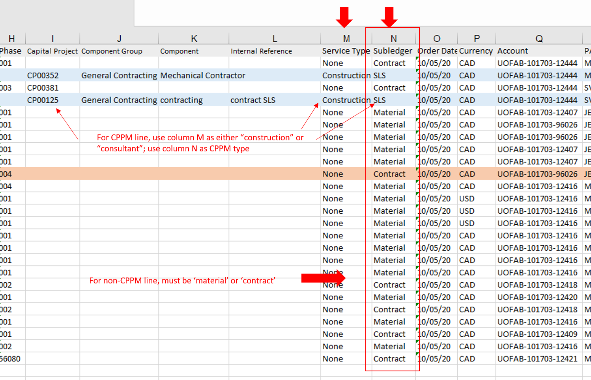

# To Run the program

1. The excel file to be processed should be put in *"V:\Purchasing Astro Boy\commitment files\Input"* folder, and there should **only** be a single excel file (.xlsx) there.

2. Double click run.bat file. Make sure downloads.xlsx is **NOT** open.

3. Fill in the AiM login username and password in the command line window, note that the password won't be shown on the screen. Click enter and the program will continue.

   

4. A successful running should generate the screenshot below. 

   

5. In any circumstances the program crushes, it should throw out an error like below. Please take a screenshots and contact Tim Zong for help.


# Important Notes for Users

1. Before running the RPA program, the excel file should be edited. 
   * For non-CPPM lines,column N's value should either be *"Material"* or *"Contract"*, indicating if this PO's subledger is "Material" or "Contract"; for CPPM lines, Column N should be the CPPM type. Otherwise, the corresponding row won't be processed.
   * For CPPM lines, column M should indicate whether it's a "construction" contract or a "consultant" contract. It's not case-sensitive, but spelling must be right.



2. Always check the downloads.xlsx after the program finishes. The program should log the PO code in AiM. Column Q, R and S are **auto generated** by this RPA program. Please manually check those error messages. Notice the new columns end with *"(demo)"* or *"(prod)"*
   * For CPPM lines, column Q will store the contract id saved in AiM system.


3. If there are any questions or improvement suggestions, feel free to contact Tim.


# Install the program (for developers only)

1. Install [Miniconda (Python)](https://docs.conda.io/en/latest/miniconda.html)  on your local machine. You can access conda via the console, to make sure it's properly installed please run `conda -V` to display the version, and run `python -V` to display the version..

2. Create new virtual environment. Open Anaconda Prompt and run (taken an example of python 3.10):

   ```conda create --name selenium_env python==3.10 –y```

3. Once it's created you can activate it by running: 

   ```conda activate selenium_env```

4. Go to the current directory, run the code under the activated virtual environment

   ```pip install -r requirements.txt``` 

5. Setup environment variables for Windows 10 System. Typical path is :C:\Users\user_ID\AppData\Local\Continuum\miniconda3\envs\selenium_env

6. To show hidden files in Windows 10:


7. Run the run_demo.bat, it will call PO_in_AiM(demo).py, and check if everything works.
8. The current design is to download the latest ***Chrome Webdriver*** automatically when running the program, no need to manually download the webdriver.
